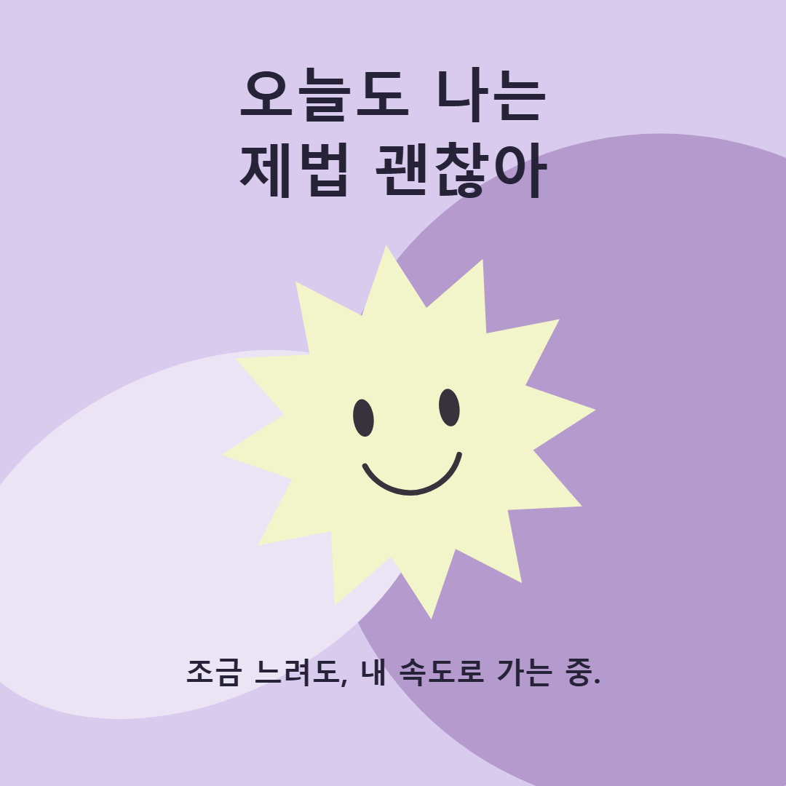
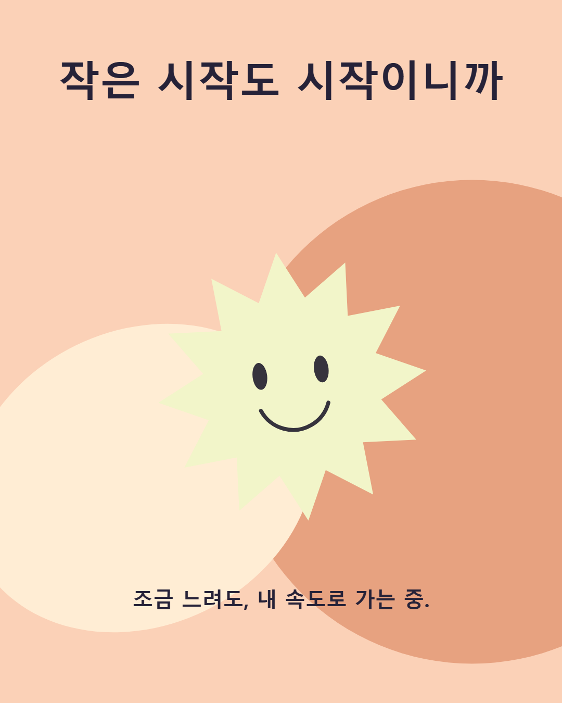
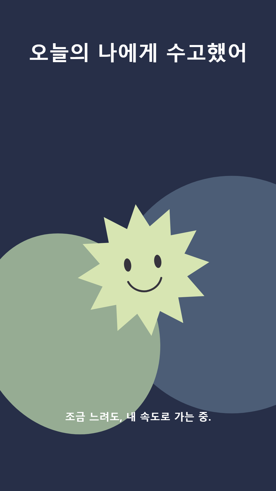

<p align="center"><sub>SKT ALEPH · PROJECT 03</sub></p>

<h1 align="center">짤·카드 스튜디오</h1>

<p align="center">
  <strong>사진 한 장, 마음에 드는 한 줄.</strong><br>
  내 사진과 한글 문구로 밈·카드·SNS 이미지를 만들어요.
</p>

<p align="center">
  <a href="https://skt-aleph-project-3-studio.vercel.app"><strong>편집기 열기 ↗</strong></a>
  &nbsp;·&nbsp;
  <a href="docs/VERIFICATION-REPORT.md">검증 보고서</a>
  &nbsp;·&nbsp;
  <a href="docs/SUBMISSION.md">과제 제출 문안</a>
</p>

<p align="center">로그인 없이 바로 시작 · 브라우저 안에 저장 · PNG/JPEG 내려받기</p>

---

## 이런 카드를 만들 수 있어요

일상의 한마디부터 응원 카드까지. 올릴 곳에 맞춰 세 가지 비율로 완성할 수 있습니다.

<table>
  <tr>
    <td align="center" width="33%"><strong>1:1 · 정사각형</strong><br><sub>1080 × 1080</sub></td>
    <td align="center" width="33%"><strong>4:5 · 세로 피드</strong><br><sub>1080 × 1350</sub></td>
    <td align="center" width="33%"><strong>9:16 · 스토리</strong><br><sub>1080 × 1920</sub></td>
  </tr>
  <tr>
    <td align="center" valign="top"><a href="docs/assets/finished-square.png"></a></td>
    <td align="center" valign="top"><a href="docs/assets/finished-portrait.png"></a></td>
    <td align="center" valign="top"><a href="docs/assets/finished-story.png"></a></td>
  </tr>
</table>

이미지를 누르면 완성본을 크게 볼 수 있습니다. 위 세 이미지는 프로젝트의 Canvas 도형 코드와 문구로 자체 합성한 결과물입니다(AI 구현). 외부 사진을 사용하지 않았으며, **사용자가 최종 완성본을 직접 확인했습니다(2026-09-21 확인 메시지 기준).** [제작·권한 기록 →](docs/ASSETS.md)

## 세 단계면 완성

1. **사진과 문구 넣기** — PNG 또는 JPEG를 불러오고 위·아래 문구를 적습니다.
2. **내 취향으로 다듬기** — 화면비를 고르고, ‘글꼴·배치 상세 설정’에서 위치·크기·색을 조절합니다. 바뀐 모습은 바로 미리 볼 수 있습니다.
3. **파일로 내려받기** — PNG 또는 JPEG로 저장합니다. 다시 쓰고 싶은 구성은 ‘내 템플릿’에 남겨 두세요.

> 기기를 옮기거나 브라우저 데이터를 지우기 전에는 **내 템플릿 → 백업·가져오기 → 작업 백업 다운로드**로 작업을 보관해 주세요.

## 만들 때 편한 기능들

| 하고 싶은 일 | 스튜디오에서 할 수 있는 일 |
|---|---|
| **문구에 분위기 더하기** | 한글 무료 폰트 7종과 기기 기본 글꼴 3종, 글자 색·정렬·테두리 조절 |
| **사진을 알맞게 담기** | 채우기 / 전체 보기, 사진 어둡기 조절, 세 가지 화면비 |
| **보이는 모습 그대로 저장하기** | 미리보기에 사용한 캔버스에서 PNG/JPEG 생성. 선택한 글꼴 준비 후 저장 |
| **마음에 드는 구성 다시 쓰기** | 템플릿 최대 12개 생성·불러오기·수정·삭제, 새로고침 뒤에도 유지 |
| **작업을 다른 기기로 옮기기** | 현재 작업과 모든 템플릿을 한 파일로 백업. 가져올 내용을 먼저 확인한 뒤 복원 |
| **편한 화면으로 작업하기** | 시스템 설정을 따르는 기본 테마, 라이트·다크 수동 전환, 모바일 편집 |

무료 한글 폰트는 **프리텐다드 · 나눔고딕 · 나눔명조 · 검은고딕 · 주아체 · 도현체 · 나눔손글씨 펜**입니다. 폰트 파일과 OFL 고지를 앱에 함께 담았으며 선택한 글꼴만 불러옵니다. [폰트 출처와 사용 조건 →](docs/FONTS.md)

## 작업은 내 브라우저에

사진과 문구는 사용 중인 브라우저에 저장됩니다. 앱은 외부 사진·폰트 서버, 분석 SDK, 원격 API를 사용하지 않습니다. 업로드 이미지는 다시 그려 원본 메타데이터를 제거하며, 사용자가 가진 원본 파일은 바꾸지 않습니다.

잘못된 이미지나 백업 파일을 넣으면 이유를 안내하고 기존 작업을 유지합니다. 백업은 내용을 확인하고 <strong>이 내용으로 복원</strong>을 눌렀을 때 적용됩니다. 취소하거나 저장에 실패해도 이전 자료를 보존합니다.

브라우저 데이터를 지우거나 시크릿 창을 닫으면 작업이 사라질 수 있습니다. 보관할 작업은 백업을 내려받아 두세요. 가져오는 사진의 사용 권한도 직접 확인해 주세요.

## 확인하고 다듬은 기록

**2026-09-21, 사용자가 과제의 모든 검사를 직접 수행하고 최종 완성 이미지 3개를 확인했다고 알려 주었습니다.** 아래 수치는 그와 별도로 실행한 자동 검사의 결과입니다.

| 구분 | 확인한 내용 | 결과 |
|---|---|---|
| Node 자동 검사 | 데이터 검증, 복합 이모지, 테마, 폰트, 백업 구조 | **33건 PASS** |
| 공개 편집기 자동 검사 | 편집 30건 + 폰트 41건 + 백업 12건 + 저장 13건 | **96건 PASS** |
| 추가 로컬 자동 검사 | 이전 4건 + 새 저장소 복구 4건 + 이전 저장소 보호 4건 + 이미지 경계 2건 | **14건 PASS** |
| 극단 입력 검사표 | 긴 한글·혼합 문자·줄바꿈·이모지·빈 문구·세로/가로/투명 이미지 등 | **12개 입력 기록** |

세 비율 모두 미리보기와 PNG의 전체 픽셀 일치를 확인했습니다. JPEG는 손실 압축이므로 픽셀 완전 일치를 주장하지 않으며, 정상 디코딩과 출력 크기를 확인했습니다. 복합 이모지 줄바꿈 결함의 수정 전후와 잘못된 입력 뒤 작업 보존도 기록했습니다.

| 더 자세히 보고 싶다면 | 문서 |
|---|---|
| 요구사항별 결과와 완성 이미지 | [검증 보고서](docs/VERIFICATION-REPORT.md) · [PDF 보기](output/pdf/T03-verification-report.pdf) |
| 실제 검사 과정과 증거 구분 | [검사 기록](docs/QA.md) · [과제 상세 기준](docs/ASSIGNMENT.md) |
| 제출할 주소·확인법·AI와 내 판단 | [제출 문안](docs/SUBMISSION.md) · [복사용 텍스트](docs/SUBMISSION-READY.txt) |
| 저장 방식과 배포 내용 | [저장·복구 안내](docs/STORAGE.md) · [Vercel 배포 기록](docs/DEPLOYMENT.md) |

검증 보고서는 검토·보관용입니다. 과제 3의 제출물은 안내에 따라 주소 2개, 확인 4줄, 판단 3줄로 준비했습니다.

<details>
<summary><strong>개발 환경에서 실행하기</strong></summary>

Node.js 22 이상이 필요합니다. 외부 패키지 설치나 API 키 설정은 필요하지 않습니다.

```sh
npm start
```

[http://127.0.0.1:8003](http://127.0.0.1:8003)에서 편집기를 엽니다.

```sh
npm test       # Node 검사
npm run build  # Vercel용 정적 파일 준비
```

앱 원본은 `public/`입니다. 빌드하면 앱 파일과 폰트·라이선스를 `dist/`에 복사합니다. 검사 코드, 문서, 로컬 증거는 편집기 배포에 포함하지 않습니다.

</details>

<details>
<summary><strong>입력 크기·저장 방식·알아둘 점</strong></summary>

| 항목 | 현재 기준 |
|---|---|
| 이미지 입력 | PNG/JPEG, **12MiB** 이하, 2,400만 화소 이하, 한 변 16,000px 이하. 파일 헤더와 실제 디코딩 결과로 검증 |
| 이미지 보관 | 긴 변 최대 1,920px로 정규화한 무손실 PNG. 메타데이터 제거, 반복 복원 시 추가 손실 방지 |
| 문구 길이 | 위 160자 / 아래 240자. 브라우저 UTF-16 길이 기준 |
| 긴 문구 | 복합 이모지를 보존하며 줄바꿈·자동 축소. 실제 저장 글자 크기 표시, 24px 미만이면 가독성 경고. 원문 자동 삭제 없음 |
| 저장 용량 | 템플릿 최대 12개, 정규화 사진 합계 64MiB, 백업 입력 80MiB |
| 저장 구조 | IndexedDB에 문서와 사진을 함께 저장. 같은 사진은 중복 제거, 저장 중·완료·실패 상태 표시 |
| 백업 호환 | JSON v2는 사진을 한 번만 포함. v1 가져오기 지원. 외부 URL·SVG는 복원하지 않음 |

12MiB·2,400만 화소는 앱의 처리 범위이며 과제 지정값이나 모든 기기의 성능 보증은 아닙니다. 브라우저 자체 저장 용량이 먼저 부족할 수 있습니다.

백업은 파일 전체를 검증한 후 파일명·템플릿 이름과 개수·문구·화면비를 보여 줍니다. 복원을 확정하면 현재 작업과 템플릿 전체를 교체합니다. 손상 자료는 자동 덮어쓰기를 막고 ‘손상 원본 다운로드’를 제공합니다.

이전 localStorage 작업은 처음 열 때 자동 이전하며 이전 원본도 남깁니다. 2026-09-21 Vercel 이전 전 Sites 주소에 저장한 작업은 옛 주소에서 JSON 백업 후 현재 주소에서 복원해야 합니다.

여러 탭에서 동시에 편집하면 마지막 저장을 기준으로 합니다. 기기 기본 글꼴이나 이모지 대체 글꼴은 운영체제에 따라 모양이 달라질 수 있습니다. 같은 화면의 미리보기와 파일은 동일한 렌더러를 사용합니다. 화면 테마는 시스템 변경을 실시간 반영하고 수동 선택도 기억하며, 카드 이미지에는 영향을 주지 않습니다.

모바일에서는 사진과 위·아래 문구를 먼저 보여 주고 글꼴·배치는 접을 수 있는 상세 설정에 모았습니다. [저장 정책과 복구 절차 →](docs/STORAGE.md)

</details>

<details>
<summary><strong>브라우저 자동 검사 실행하기</strong></summary>

검사는 템플릿을 변경하므로 **자료가 없는 전용 테스트 브라우저**에서 실행합니다. gstack `/browse`로 로컬 편집기를 연 뒤 다음 파일을 `eval`로 실행합니다.

| 파일 | 검사 범위 |
|---|---|
| `tests/browser.js` | 편집·파일 거부·세 비율·템플릿·극단 입력 |
| `tests/fonts-browser.js` | 7종 폰트 로드, 세 비율 PNG 픽셀 비교, JPEG 디코딩, 복원·실패 시 보존 |
| `tests/backup-browser.js` | 확인 전 무변경, 취소, 손상·필수 누락 거부, 저장 실패 시 보존, 명시적 복원 |
| `tests/storage-browser.js` | 큰 사진 CRUD, 반복 복원 시 픽셀 보존, 가독성 경고 |
| `tests/migration-*-browser.js` | 실제 재접속 후 이전 자료 유지 |
| `tests/recovery-*-browser.js` · `tests/legacy-recovery-*-browser.js` | 새 저장소·이전 저장소의 손상 원본 보호와 복구 |
| `tests/image-boundary-browser.js` | 이미지 입력 경계 |

검사 중 다운로드 Blob과 대화상자 응답을 가로채고 이미지 전체 픽셀을 비교합니다. 실제 파일 저장과 시각 확인은 별도로 수행합니다. seed 파일은 전용 QA 출처에서만 사용하며, 실행 순서는 [저장·복구 안내](docs/STORAGE.md)를 따릅니다.

원본 증거는 `qa/`에 로컬 보관합니다. README에 공개한 완성 이미지 3개는 그 원본을 수정 없이 복사한 것입니다.

</details>

---

<p align="center">오늘의 한 줄을, 오늘의 카드로.<br><a href="https://skt-aleph-project-3-studio.vercel.app"><strong>짤·카드 스튜디오에서 만들기 ↗</strong></a></p>
